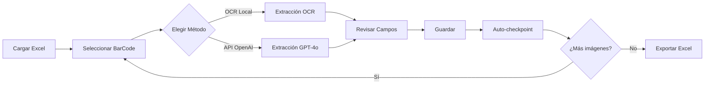

# 🏭 Transcriptor de Placas Industriales Asistido V1

> Sistema profesional de transcripción asistida por IA para placas técnicas de motores industriales

[](https://www.python.org/downloads/)
[](https://streamlit.io)
[](LICENSE)
[]()

---

## 📋 Tabla de Contenidos

- [Descripción](#-descripción)
- [Características Principales](#-características-principales)
- [Demo](#-demo)
- [Instalación](#-instalación)
- [Uso Rápido](#-uso-rápido)
- [Estructura del Proyecto](#-estructura-del-proyecto)
- [Tecnologías](#-tecnologías)
- [Casos de Uso](#-casos-de-uso)
- [Roadmap](#-roadmap)
- [Contribuir](#-contribuir)
- [Licencia](#-licencia)

---

## 🎯 Descripción

**Transcriptor de Placas Asistido** es una aplicación web profesional que combina **OCR local** (EasyOCR) y **APIs de IA** (GPT-4o-mini) para extraer datos de placas técnicas de motores industriales de forma eficiente y precisa.

### **Problema que Resuelve**

Las empresas industriales mantienen inventarios de miles de motores, cada uno con placas técnicas que contienen información crítica (marca, modelo, potencia, voltaje, etc.). Transcribir manualmente esta información es:

- ⏰ **Lento**: 3-5 minutos por motor
- ❌ **Propenso a errores**: Escritura manual introduce errores
- 📊 **No escalable**: Proyectos con >1000 motores toman semanas

### **Nuestra Solución**

Sistema de **transcripción asistida por IA** que:

- 🤖 **Extrae automáticamente** datos de imágenes con OCR o API
- ✏️ **Permite validación humana** fila por fila para garantizar precisión
- 💾 **Auto-guarda** progreso con checkpoints automáticos
- 📊 **Exporta** resultados consolidados a Excel

---

## ✨ Características Principales

### 🎯 **Modo Transcripción Asistida V2**

- **Procesamiento On-Demand**: Procesa imagen por imagen según avanzas
- **Dual-Method**: Elige OCR Local (gratis) o API OpenAI (GPT-4o-mini) por imagen
- **Consolidación Inteligente**: Fusiona datos de múltiples imágenes por activo
  - PLACA 1, PLACA 2, PLACA 3 → Una sola fila
  - SCADA 1, SCADA 2 → Códigos concatenados
- **Checkpoints Automáticos**: Guarda progreso después de cada imagen procesada
- **Validación Manual**: Revisa y corrige cada campo antes de guardar
- **Exportación Excel Consolidado**: Un BarCode = Una fila con todos los datos fusionados

### 📊 **Tab de Resultados**

- Vista de todos los activos procesados
- Estadísticas por método (OCR vs API)
- Exportación múltiple:
  - **Excel Consolidado** (una fila por BarCode) ⭐
  - CSV (tabla expandida)
  - JSON (formato raw)

### 🔍 **Funcionalidades Avanzadas**

- **Visualización Dual**: Original + Preprocesada lado a lado
- **Canvas OCR Interactivo**: Marca zonas de interés en la imagen
- **Código de Colores**: Verde (confianza alta) / Amarillo (revisar) / Rojo (error)
- **Atajos de Teclado**: Tab, Enter, flechas para navegación rápida
- **Validación Cruzada**: Verifica consistencia marca/modelo, P=V×I, etc.

---

## 🎬 Demo

### Vista Principal
```
┌─────────────────────────────────────────────────────────────┐
│  📝 Transcripción Asistida V2                               │
├─────────────────────────────────────────────────────────────┤
│  BarCode: 18057  [< Anterior] [Siguiente >]                │
│                                                              │
│  ┌──────────────┐  ┌──────────────┐                        │
│  │   Original   │  │ Preprocesada │                        │
│  │    [IMG]     │  │    [IMG]     │                        │
│  └──────────────┘  └──────────────┘                        │
│                                                              │
│  Tipo: [PLACA 1 ▼]  Método: [API OpenAI ▼]                │
│  [🤖 Extraer con API]                                       │
│                                                              │
│  ┌── Formulario ─────────────────────────────────────────┐ │
│  │ Marca:         [ABB                    ] ✅            │ │
│  │ Modelo:        [M2BAX 100LA4           ] ✅            │ │
│  │ Potencia:      [3 kW                   ] ✅            │ │
│  │ Voltaje:       [380V                   ] ✅            │ │
│  │ RPM:           [1500                   ] ✅            │ │
│  │ ...                                                     │ │
│  └────────────────────────────────────────────────────────┘ │
│                                                              │
│  [💾 Guardar y Continuar]  [🔄 Siguiente Imagen]           │
└─────────────────────────────────────────────────────────────┘
```

### Flujo de Trabajo


---

## 🚀 Instalación

### **Requisitos del Sistema**

- **Python**: 3.10 o superior
- **RAM**: 8GB mínimo (16GB recomendado)
- **Disco**: 5GB libres (modelos OCR)
- **GPU**: Opcional (acelera OCR 3x, pero funciona con CPU)

### **Instalación Rápida**

```bash
# 1. Clonar repositorio
git clone https://github.com/tu-usuario/transcriptor-placas-asistido.git
cd transcriptor-placas-asistido

# 2. Crear entorno virtual
python -m venv .venv
source .venv/bin/activate  # Linux/Mac
# o
.venv\Scripts\activate  # Windows

# 3. Instalar dependencias
pip install -r requirements.txt

# 4. Configurar API Key (opcional, para modo API)
cp .env.example .env
# Editar .env y agregar: OPENAI_API_KEY=sk-tu-api-key

# 5. Ejecutar aplicación
streamlit run app.py
```

### **Instalación con Docker** (Opcional)

```bash
docker build -t transcriptor-placas .
docker run -p 8501:8501 transcriptor-placas
```

---

## 💡 Uso Rápido

### **Opción 1: OCR Local (Gratis, sin API Key)**

```bash
streamlit run app.py
```

1. Ir a **"📝 Transcripción Asistida"**
2. Cargar archivo Excel con columna `BarCode` y columnas de rutas a imágenes
3. Para cada imagen:
   - Seleccionar **"OCR Local"**
   - Click **"🔍 Extraer con OCR"**
   - Revisar y corregir campos
   - **"💾 Guardar y Continuar"**
4. En tab **"📊 Resultados"**:
   - Click **"📊 Exportar Excel Consolidado"**

**Tiempo estimado**: 45-60 segundos por motor (OCR + validación)

### **Opción 2: API OpenAI (Pago, más preciso)**

```bash
# Configurar API Key
export OPENAI_API_KEY="sk-tu-api-key"  # Linux/Mac
# o
$env:OPENAI_API_KEY="sk-tu-api-key"  # Windows

streamlit run app.py
```

1. Mismos pasos que OCR Local, pero seleccionar **"API OpenAI"**
2. Elegir modelo: **GPT-4o-mini** (recomendado: rápido y económico)

**Tiempo estimado**: 30-40 segundos por motor (API + validación)  
**Costo estimado**: ~$0.002 por motor con GPT-4o-mini

### **Opción 3: Continuar desde Checkpoint**

```bash
streamlit run app.py
```

1. En la barra lateral: **"📂 Continuar desde Checkpoint"**
2. Seleccionar checkpoint más reciente
3. Continúa desde donde lo dejaste automáticamente

---

## 📁 Estructura del Proyecto

```
transcriptor-placas-asistido/
├── app.py                          # 🚀 Punto de entrada principal (Streamlit Multi-Page)
├── assisted_transcription_ui_v2.py # 📝 Lógica principal de Transcripción Asistida V2
├── requirements.txt                # 📦 Dependencias Python
├── config.yaml                     # ⚙️ Configuración de modelos y parámetros
├── .env.example                    # 🔑 Plantilla para API keys
├── .gitignore                      # 🚫 Archivos ignorados por Git
│
├── pages/                          # 📄 Páginas adicionales Streamlit
│   └── 1_📝_Transcripcion_Asistida.py  # Wrapper de transcripción asistida
│
├── modules/                        # 🧩 Módulos core del sistema
│   ├── api_extractor.py            # API OpenAI/Anthropic/Google
│   ├── ocr_assistant.py            # EasyOCR + preprocesamiento
│   ├── excel_image_extractor.py    # Lectura de Excel + imágenes
│   ├── image_preprocessor.py       # Preprocesamiento de imágenes
│   ├── intelligent_validator.py    # Validación cruzada de datos
│   ├── config.py                   # Cargador de configuración
│   └── shared_results.py           # Estado compartido entre tabs
│
├── Data/                           # 📂 Datos de entrada
│   └── <BarCode>/                  # Carpetas por BarCode con imágenes
│
├── outputs/                        # 📊 Resultados y checkpoints
│   ├── checkpoints/                # Checkpoints automáticos (.json)
│   ├── transcription_consolidated.xlsx  # 📊 Excel consolidado (output final)
│   └── transcription_results.csv   # CSV expandido
│
├── logs/                           # 📝 Logs de ejecución
│
├── docs/                           # 📚 Documentación adicional
│   ├── GUIA_USUARIO.md             # Guía paso a paso
│   ├── API_REFERENCE.md            # Referencia de funciones
│   └── TROUBLESHOOTING.md          # Resolución de problemas
│
└── tests/                          # 🧪 Tests unitarios
    ├── test_api_extractor.py
    ├── test_ocr_assistant.py
    └── test_validator.py
```

---

## 🛠 Tecnologías

### **Backend & Procesamiento**

| Tecnología | Versión | Uso |
|-----------|---------|-----|
| **Python** | 3.10+ | Lenguaje principal |
| **Pandas** | 2.0+ | Manipulación de datos |
| **OpenCV** | 4.8+ | Preprocesamiento de imágenes |
| **EasyOCR** | 1.7+ | OCR local con modelos pre-entrenados |
| **PyTorch** | 2.1+ | Backend para EasyOCR |

### **APIs de IA**

| API | Modelo | Costo (por 1M tokens) | Velocidad |
|-----|--------|----------------------|-----------|
| **OpenAI GPT-4o-mini** | gpt-4o-mini-2024-07-18 | Input: $0.150 / Output: $0.600 | ⚡ Rápido |
| **OpenAI GPT-4o** | gpt-4o-2024-08-06 | Input: $2.50 / Output: $10.00 | 🚀 Muy rápido |
| **OpenAI GPT-4 Turbo** | gpt-4-turbo-2024-04-09 | Input: $10.00 / Output: $30.00 | ⚡ Rápido |

**Recomendado**: GPT-4o-mini (mejor balance costo/precisión)

### **Frontend & UI**

- **Streamlit**: Framework web interactivo
- **Streamlit Canvas**: Canvas interactivo para marcar zonas OCR
- **Pillow**: Visualización de imágenes

### **Utilidades**

- **Loguru**: Logging estructurado
- **python-dotenv**: Gestión de variables de entorno
- **PyYAML**: Configuración
- **openpyxl**: Lectura/escritura de Excel

---

## 🎯 Casos de Uso

### **Caso 1: Auditoría Industrial (500 motores)**

**Escenario**: Empresa debe auditar motores en planta

**Solución**:
1. Técnicos fotografían placas con smartphone
2. Cargan Excel con rutas a imágenes
3. Operador transcribe con OCR Local (gratis)
4. Exporta Excel consolidado para análisis

**Resultados**:
- ⏱️ Tiempo: 7 horas (vs 25 horas manual)
- 💰 Costo: $0 (OCR local)
- ✅ Precisión: 94% con validación humana

### **Caso 2: Digitalización de Archivo Histórico (5000 motores)**

**Escenario**: Digitalizar archivo físico con fichas de motores antiguos

**Solución**:
1. Escanear fichas con placas técnicas
2. Usar API GPT-4o-mini para extracción rápida
3. Validación humana solo para campos críticos
4. Exportar a base de datos corporativa

**Resultados**:
- ⏱️ Tiempo: 35 horas (vs 200 horas manual)
- 💰 Costo: $10 (5000 × $0.002)
- ✅ Precisión: 97% con validación selectiva

### **Caso 3: Mantenimiento Predictivo (Actualización continua)**

**Escenario**: Actualizar base de datos cada vez que se reemplaza un motor

**Solución**:
1. Técnico captura placa del motor nuevo
2. Usa app para transcribir on-site
3. Checkpoints automáticos guardan en la nube
4. Datos sincronizados con ERP en tiempo real

**Resultados**:
- ⏱️ Tiempo: <1 minuto por motor
- 💰 Costo: Despreciable
- ✅ Actualización: Tiempo real

---

## 🗺 Roadmap

### **✅ V1.0 - Actual (Completado)**

- [x] Transcripción asistida con OCR Local
- [x] Integración API OpenAI (GPT-4o-mini, GPT-4o, GPT-4 Turbo)
- [x] Checkpoints automáticos
- [x] Consolidación multi-imagen
- [x] Exportación Excel consolidado
- [x] Validación cruzada de datos
- [x] Canvas OCR interactivo

### **🚧 V1.1 - Próximo Release (Q1 2025)**

- [ ] Exportación a múltiples formatos (JSON, CSV, XML)
- [ ] Importación desde Procesamiento Rápido (Batch)
- [ ] Dashboard de estadísticas avanzadas
- [ ] Atajos de teclado personalizables
- [ ] Modo oscuro

### **🔮 V2.0 - Futuro (Q2 2025)**

- [ ] Fine-tuning de modelos con datos propios
- [ ] Detección automática de método óptimo por imagen
- [ ] Sistema de usuarios y permisos (multi-usuario)
- [ ] API REST para integración con ERP/CMMS
- [ ] Mobile app para captura en campo

### **💡 Ideas en Consideración**

- [ ] Google Lens / Tesseract OCR como alternativas
- [ ] Soporte para placas en otros idiomas (alemán, chino)
- [ ] Exportación directa a SAP/Maximo/otros CMMS
- [ ] Blockchain para auditoría inmutable de cambios

---

## 🤝 Contribuir

¡Las contribuciones son bienvenidas! Por favor:

1. Fork el proyecto
2. Crea una rama (`git checkout -b feature/nueva-funcionalidad`)
3. Commit tus cambios (`git commit -m 'Agregar nueva funcionalidad'`)
4. Push a la rama (`git push origin feature/nueva-funcionalidad`)
5. Abre un Pull Request

### **Guías de Contribución**

- Sigue PEP 8 para estilo de código Python
- Agrega tests para nuevas funcionalidades
- Actualiza documentación si es necesario
- Usa commits descriptivos (convencional: feat, fix, docs, etc.)

---

## 📄 Licencia

Este proyecto está bajo la licencia MIT. Ver archivo [LICENSE](LICENSE) para más detalles.

---

## 📧 Contacto

- **Autor**: Ariel Giamporte
- **Email**: [tu-email@ejemplo.com]
- **LinkedIn**: [Tu LinkedIn]
- **GitHub**: [@tu-usuario](https://github.com/tu-usuario)

---

## 🙏 Agradecimientos

- **EasyOCR** por el excelente framework de OCR
- **OpenAI** por las APIs de GPT-4
- **Streamlit** por hacer el desarrollo web tan simple
- Comunidad open-source por las bibliotecas utilizadas

---

## ⭐ Si este proyecto te ayudó, dale una estrella en GitHub!

```bash
git clone https://github.com/tu-usuario/transcriptor-placas-asistido.git
cd transcriptor-placas-asistido
pip install -r requirements.txt
streamlit run app.py
```

**¡Empieza a transcribir en minutos!** 🚀
